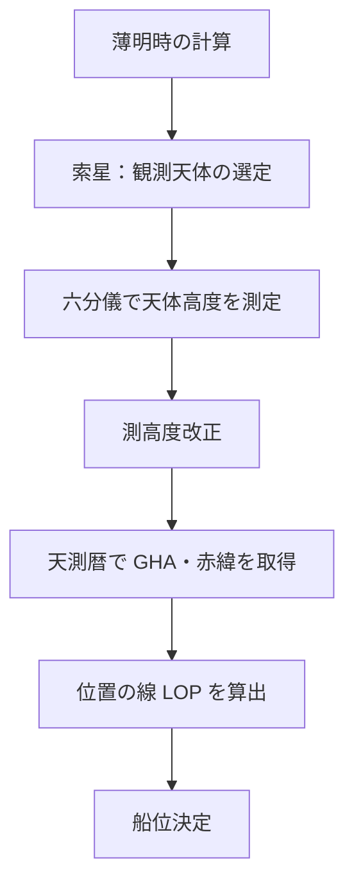
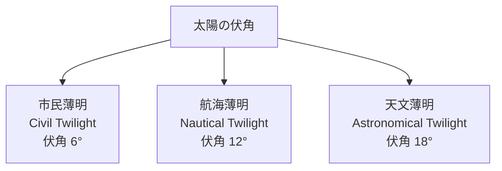
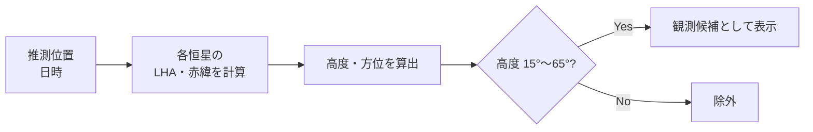
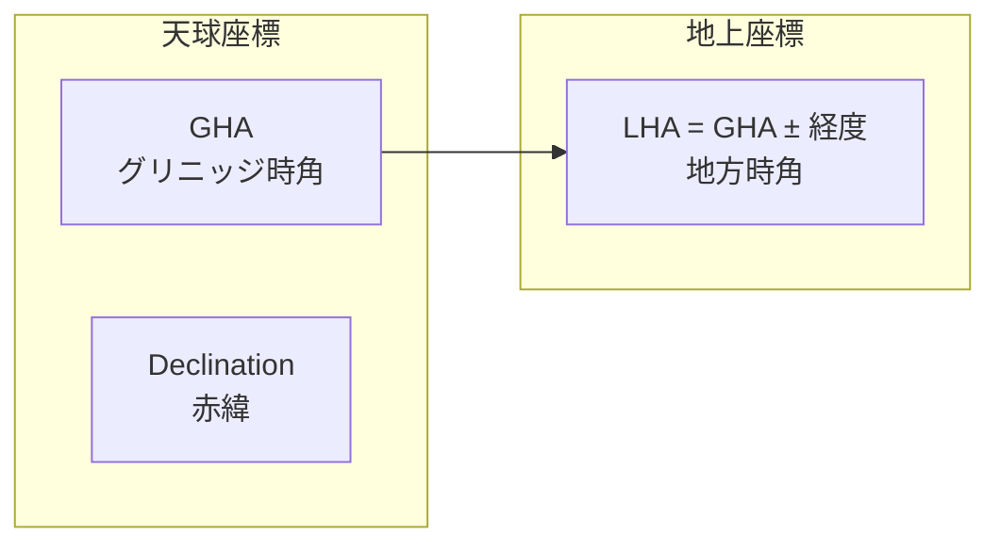
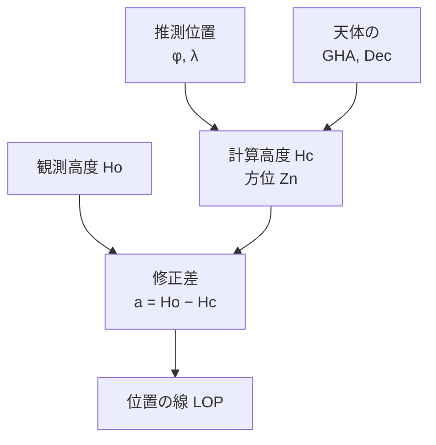
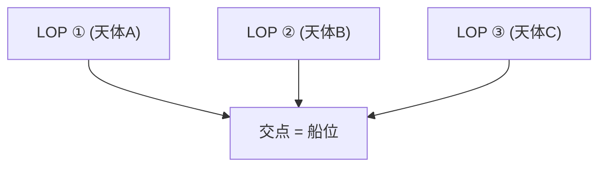
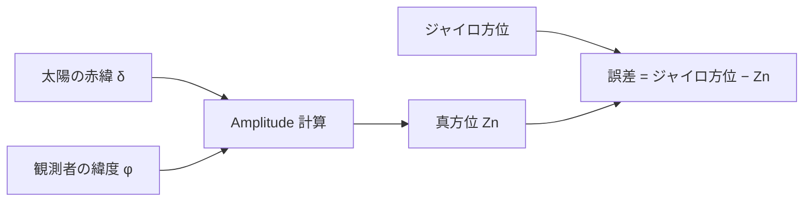

# 天文航法 (Celestial Navigation)

天体観測に基づく船位決定のための計算です。

## 全体の流れ

---

## 薄明時 (Twilight)

天体観測に適した時間帯（薄明時）を計算します。

### 薄明の種類

| 種類     | 太陽の伏角 | 用途                                 |
| -------- | ---------- | ------------------------------------ |
| 市民薄明 | 6°         | 水平線が見える                       |
| 航海薄明 | 12°        | 星と水平線が両方見える（天測に最適） |
| 天文薄明 | 18°        | 完全な暗闇の始まり                   |

### 計算式

$$
\cos(\text{LHA}) = \frac{\sin(h) - \sin\phi \sin\delta}{\cos\phi \cos\delta}
$$

ここで h は太陽の伏角（−6°, −12°, −18° など）です。

---

## 索星 (Star Finder)

推測位置と日時から、観測可能な天体の高度と方位を計算します。

### 計算フロー

### 計算高度

$$
\sin(Hc) = \sin\phi \sin\delta + \cos\phi \cos\delta \cos(\text{LHA})
$$

### 方位角

$$
\cos(Z) = \frac{\sin\delta - \sin\phi \sin(Hc)}{\cos\phi \cos(Hc)}
$$

---

## 天測暦 (Nautical Almanac)

太陽の GHA（Greenwich Hour Angle）と赤緯（Declination）を日時から算出する簡易計算です。

### 用語

---

## 位置の線 (Line of Position / LOP)

天体の観測高度と計算高度の差（修正差 = Intercept）から、位置の線を求めます。

### Sight Reduction

### 計算式

**計算高度 Hc:**

$$
\sin(Hc) = \sin\phi \sin\delta + \cos\phi \cos\delta \cos(\text{LHA})
$$

**方位角 Zn:**

$$
\cos(Z) = \frac{\sin\delta - \sin\phi \sin(Hc)}{\cos\phi \cos(Hc)}
$$

**修正差（Intercept）:**

$$
a = Ho - Hc
$$

- a > 0: 天体方向に近づく（Towards）
- a < 0: 天体方向から遠ざかる（Away）

---

## 船位決定 (Position Fix)

複数の LOP の交点から最確船位を求めます。

### 概念図

2本の LOP の場合は交点、3本以上の場合は最小二乗法で最確位置を算出します。

---

## 出没方位角 (Gyro & Amplitude)

太陽の出没時の方位角（Amplitude）を計算し、ジャイロコンパスの誤差を求めます。

### 計算フロー

### 計算式

$$
\sin(\text{Amp}) = \frac{\sin\delta}{\cos\phi}
$$

| 条件         | 真方位                 |
| ------------ | ---------------------- |
| 日出・赤緯 N | N(90° − Amp)E → E 寄り |
| 日出・赤緯 S | S(90° − Amp)E → E 寄り |
| 日没・赤緯 N | N(90° − Amp)W → W 寄り |
| 日没・赤緯 S | S(90° − Amp)W → W 寄り |
