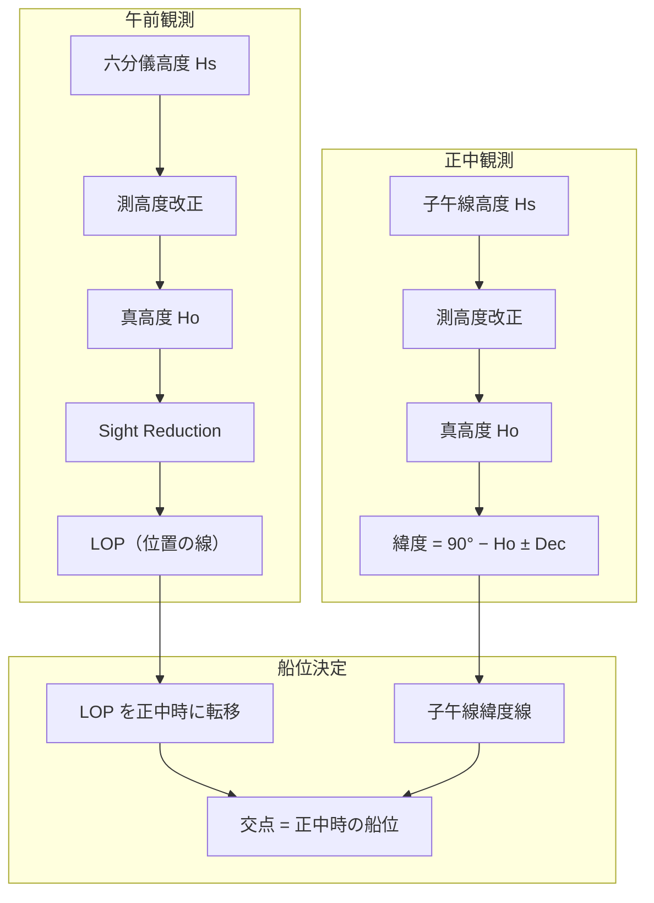
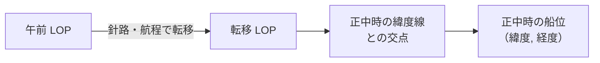

# 海技試験 (Exam)

海技試験（三級海技士 航海）向けの総合計算です。

## メリパス計算 3N (Meripass Calculation)

午前の天体観測（LOP）と正中時の子午線高度緯度法（Meridian Passage）を組み合わせて、正中時の船位を決定する総合計算です。三級海技士（航海）の筆記試験で出題される形式に対応しています。

### 計算の全体フロー

### 計算手順

#### Step 1: 午前の LOP

1. 六分儀高度（Hs）を測高度改正して真高度（Ho）を求める
2. 推測位置と天測暦データから計算高度（Hc）と方位角（Zn）を算出
3. 修正差（Intercept）= Ho − Hc を計算
4. LOP を決定

#### Step 2: 正中時の緯度

1. 正中時の六分儀高度（Hs）を測高度改正して真高度（Ho）を求める
2. 子午線高度緯度法で緯度を算出

$$
\text{緯度} = 90° - Ho \pm \delta
$$

| 条件 | 計算 |
|------|------|
| 天体が南中（観測者より南） | φ = 90° − Ho + δ |
| 天体が北中（観測者より北） | φ = 90° − Ho − δ（の符号を反転）|

#### Step 3: LOP の転移と船位決定

1. 午前の LOP を、午前〜正中間の針路・航程で転移（Running Fix）
2. 転移した LOP と正中時の緯度線の交点が船位

### 入力項目

| 区分 | 項目 |
|------|------|
| 午前観測 | 六分儀高度、器差、眼高、改正総数、推測位置、GHA、赤緯 |
| 正中観測 | 子午線高度、器差、眼高、改正総数、赤緯 |
| 航海データ | 針路、航程（午前→正中間） |
