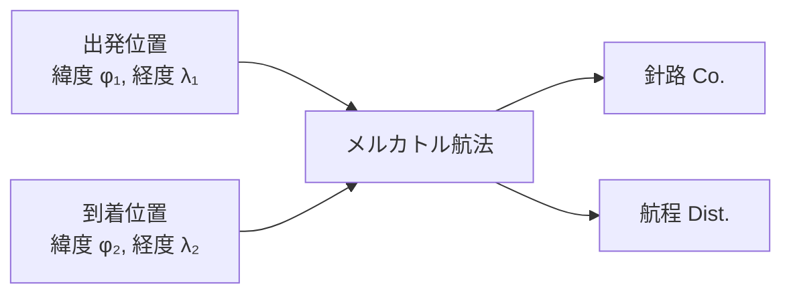
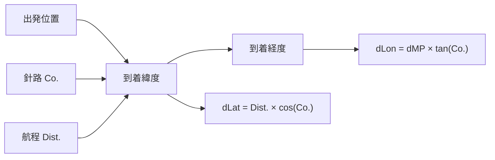
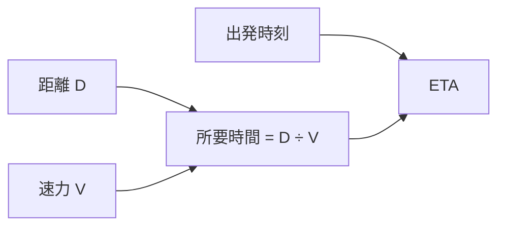

# 航海計画 (Pilot 1)

航路計画に必要な基本的な航法計算をまとめています。

## 針路・航程 (Course & Distance)

メルカトル航法（Mercator Sailing）により、2地点間の針路と航程を算出します。

### 計算フロー

### 計算式

| 記号 | 意味             |
| ---- | ---------------- |
| dLat | 緯度差 = φ₂ − φ₁ |
| dLon | 経度差 = λ₂ − λ₁ |
| dMP  | メルカトル部差   |

$$
\text{Co.} = \arctan\left(\frac{d\text{Lon}}{d\text{MP}}\right)
$$

$$
\text{Dist.} = \frac{d\text{Lat}}{\cos(\text{Co.})}
$$

> **補足:** 緯度差が 0 の場合（真東/真西）は横距（Dep.）= dLon × cos(φ) で航程を求めます。

---

## 到着点 (Dead Reckoning)

出発位置・針路・航程から到着点の緯度経度を算出します。

### 計算フロー

### 計算式

$$
d\text{Lat} = \text{Dist.} \times \cos(\text{Co.})
$$

$$
\text{Dep.} = \text{Dist.} \times \sin(\text{Co.})
$$

$$
d\text{Lon} = \frac{\text{Dep.}}{\cos(\phi_m)}
$$

---

## 大圏航法 (Great Circle)

地球上の2点間の最短距離（大圏距離）と初針路を算出します。

### 航路比較

### 計算式

**大圏距離:**

$$
\cos(D) = \sin\phi_1 \sin\phi_2 + \cos\phi_1 \cos\phi_2 \cos(d\text{Lon})
$$

**初針路:**

$$
\cos(C) = \frac{\sin\phi_2 - \sin\phi_1 \cos(D)}{\cos\phi_1 \sin(D)}
$$

---

## 集成大圏航法 (Composite Sailing)

制限緯度（Limiting Latitude）を設けた複合航路の計算です。高緯度の氷海域などを避けつつ、可能な限り最短距離の航路を求めます。

### 航路構成

### 計算の流れ

1. 出発地 → 制限緯度の接点 V₁ までの大圏を計算
2. V₁ → V₂ の等緯度圏上の航程を計算（Parallel Sailing）
3. V₂ → 到着地 までの大圏を計算
4. 総航程 = 区間①+ 区間② + 区間③

---

## 到着時刻 (ETA)

出発時刻・距離・速力から到着予定時刻を計算します。

### 計算フロー

$$
\text{ETA} = \text{出発時刻} + \frac{\text{距離}}{\text{速力}}
$$
