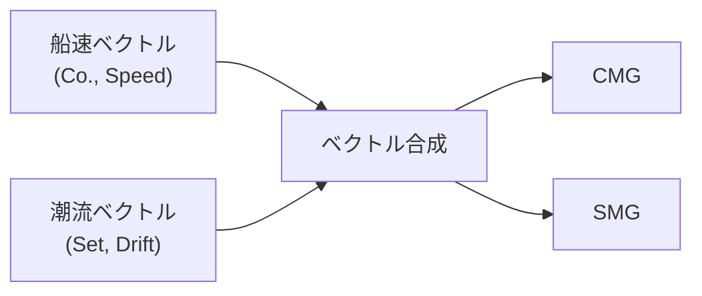
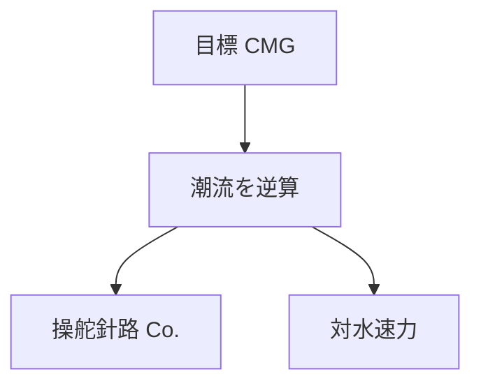
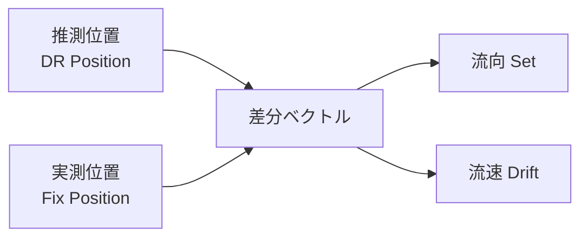
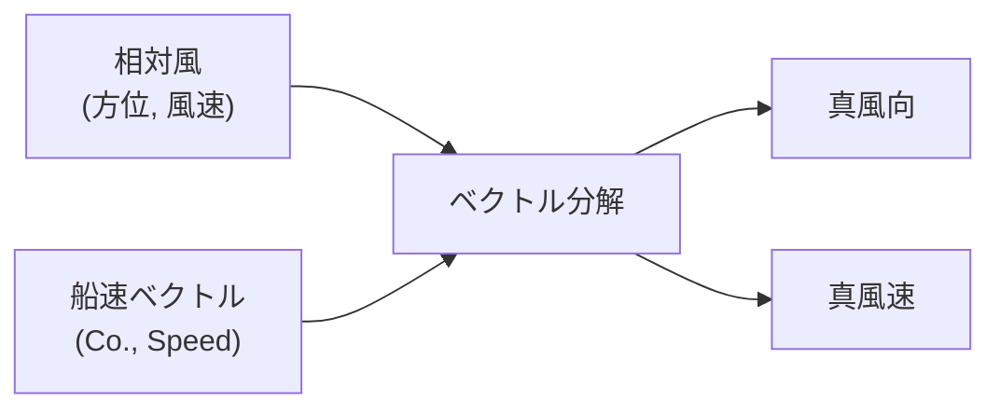
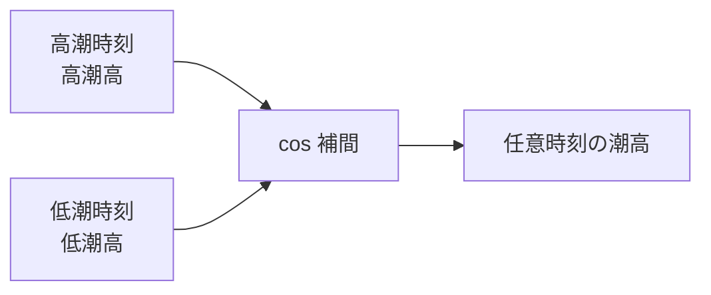

# その他の航法 (Pilot 2)

潮流・風・潮汐など外的要因を考慮した航法計算です。

## 実航針路・速力 (CMG / SMG)

船速・針路と潮流から、実際に進む針路（CMG: Course Made Good）と速力（SMG: Speed Made Good）を算出します。

### ベクトル合成

### 計算式

船速ベクトルと潮流ベクトルの成分を分解し、合成します。

$$
N = V \cos(\text{Co.}) + D_r \cos(\text{Set})
$$

$$
E = V \sin(\text{Co.}) + D_r \sin(\text{Set})
$$

$$
\text{CMG} = \arctan\left(\frac{E}{N}\right), \quad \text{SMG} = \sqrt{N^2 + E^2}
$$

---

## 視針路・対水速力 (Course to Steer)

目標の針路（CMG）を達成するために、潮流を考慮した操舵針路と対水速力を算出します。

### 概念図

潮流三角形の正弦定理を使用して求めます。

---

## 視針路・実航速力 (Course to Steer & SMG)

目標の針路を達成するための操舵針路に加え、実効速力（SMG）も同時に算出します。

---

## 流向・流速 (Set & Drift)

推測位置と実測位置の差から、海流の方向（Set）と速度（Drift）を推定します。

### 推定フロー

### 計算式

$$
\text{Set} = \arctan\left(\frac{\text{Dep.}}{d\text{Lat}}\right)
$$

$$
\text{Drift} = \frac{d\text{Lat}}{\cos(\text{Set})} \div \text{経過時間}
$$

---

## 真風向・風速 (True Wind)

船上で観測される相対風（Apparent Wind）と船速・針路から、真風向・真風速を算出します。

### ベクトル分解

$$
\text{真風} = \text{相対風ベクトル} + \text{船速ベクトル}
$$

> **注意:** 相対風は船首方向を基準とした角度で入力します。

---

## 潮高計算 (Tide Height)

cos 補間法（Rule of Twelfths の精密版）を用い、任意時刻の潮高を算出します。

### 潮汐曲線

### 計算式

$$
h(t) = \frac{H + L}{2} + \frac{H - L}{2} \cos\left(\pi \cdot \frac{t - t_H}{t_L - t_H}\right)
$$

| 記号 | 意味       |
| ---- | ---------- |
| H    | 高潮高     |
| L    | 低潮高     |
| t_H  | 高潮時刻   |
| t_L  | 低潮時刻   |
| t    | 求める時刻 |

---

## 潮流計算 (Tidal Stream)

基準港の潮流データと時間差を用い、特定海域の潮流（方向・速度）を補間計算します。
