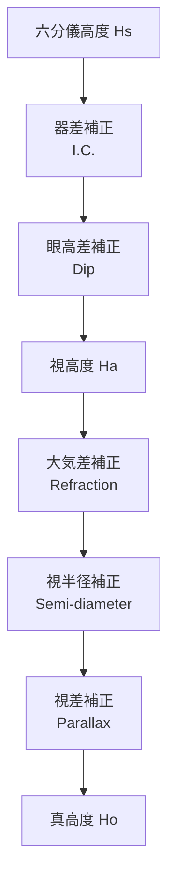
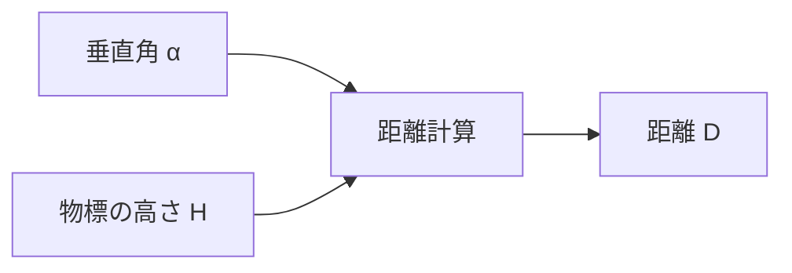

# 六分儀 (Sextant)

六分儀による測定値の補正と、六分儀を使った距離計算です。

## 測高度改正 (Altitude Correction)

六分儀で測定した天体の高度（Sextant Altitude: Hs）を真高度（Observed Altitude: Ho）に補正します。

### 改正の流れ

### 各補正値

| 補正   | 記号 | 説明                                     |
| ------ | ---- | ---------------------------------------- |
| 器差   | I.C. | 六分儀固有の誤差                         |
| 眼高差 | Dip  | 観測者の目の高さによる補正               |
| 大気差 | R    | 大気の屈折による補正                     |
| 視半径 | S.D. | 太陽・月の縁を観測した場合の中心への補正 |
| 視差   | P    | 月など近い天体の視差補正                 |

### 計算式

$$
Ha = Hs + I.C. + Dip
$$

$$
Ho = Ha + R + S.D. + P
$$

**眼高差:**

$$
Dip = -1.776' \sqrt{h_e}
$$

（h_e: 眼高 [m]）

**大気差（標準大気）:**

$$
R = -\frac{0.9667'}{tan(Ha + \frac{7.32}{Ha + 4.32})}
$$

---

## 物標距離 (Distance to Object)

六分儀で物標（灯台など）の垂直角を測り、物標までの距離を計算します。

### 計算フロー

### 計算式

$$
D = \frac{H}{\tan(\alpha)}
$$

> **注意:** 距離が大きい場合は地球の曲率補正が必要です。
