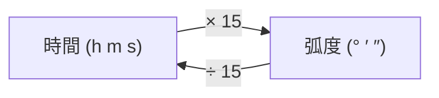
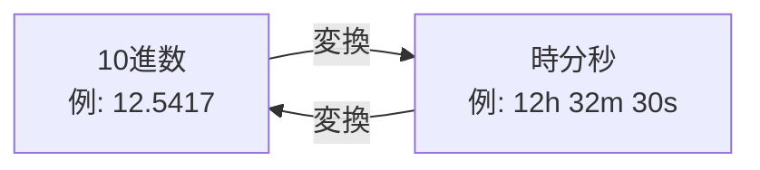
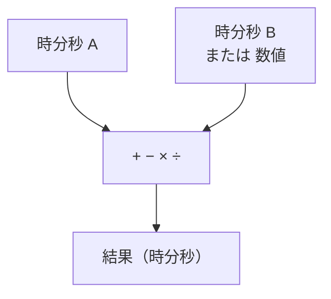

# 時間・弧度変換 / 四則計算

航海計算で頻繁に必要となる、時間と弧度の変換および時分秒の四則演算です。

## 時間 → 弧度 (Time to Arc)

時分秒を度分秒に変換します。地球は24時間で360°回転するため、以下の関係があります。

### 変換関係

| 時間 | 弧度 |
|------|------|
| 1h | 15° |
| 1m | 15′ |
| 1s | 15″ |
| 4m | 1° |
| 4s | 1′ |

### 計算式

$$
\text{度} = \text{時} \times 15 + \text{分} \times \frac{15}{60} + \text{秒} \times \frac{15}{3600}
$$

---

## 弧度 → 時間 (Arc to Time)

度分秒を時分秒に変換します。上記の逆変換です。

$$
\text{時} = \text{度} \div 15 + \text{分} \div \frac{15}{60} + \text{秒} \div \frac{15}{3600}
$$

---

## 時分秒変換 (HMS ↔ Decimal)

10進数と時分秒（60進法）の相互変換を行います。

### 変換フロー

### 10進数 → 時分秒

$$
h = \lfloor D \rfloor, \quad m = \lfloor (D - h) \times 60 \rfloor, \quad s = ((D - h) \times 60 - m) \times 60
$$

---

## 四則計算 (Arithmetic)

時分秒形式（60進法）での加算・減算・乗算・除算を行います。

### 対応演算

繰り上がり・繰り下がりを自動処理します。

**例:** `12h 45m 30s + 3h 28m 50s = 16h 14m 20s`
